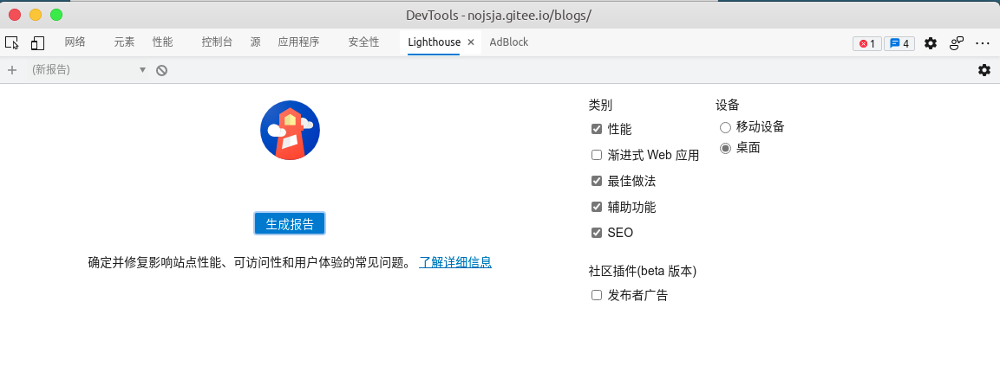
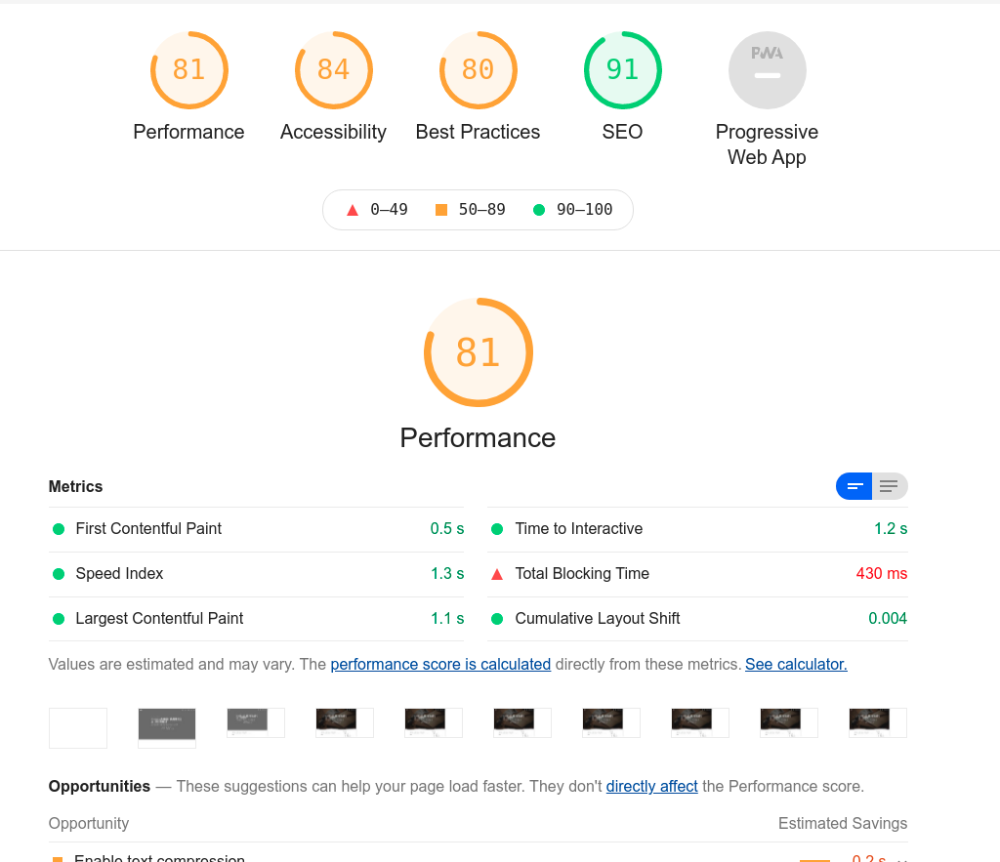
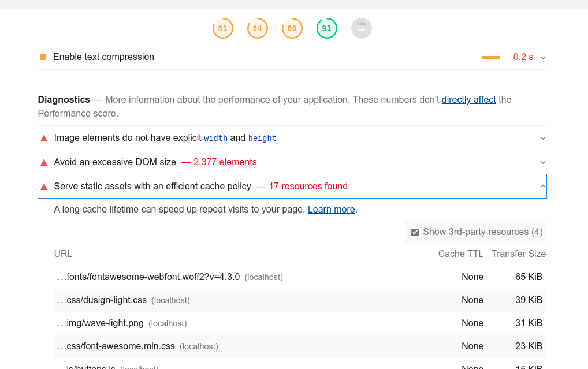

## Contents
---
- [## Contents](#contents)
- [## 前言](#%E5%89%8D%E8%A8%80)
  - [1. hexo 是什么？](#1-hexo-%E6%98%AF%E4%BB%80%E4%B9%88)
  - [2. 何为优化？](#2-%E4%BD%95%E4%B8%BA%E4%BC%98%E5%8C%96)
- [## 性能优化指标](#%E6%80%A7%E8%83%BD%E4%BC%98%E5%8C%96%E6%8C%87%E6%A0%87)
  - [1. 整体运行性能](#1-%E6%95%B4%E4%BD%93%E8%BF%90%E8%A1%8C%E6%80%A7%E8%83%BD)
  - [2. 网站可访问性](#2-%E7%BD%91%E7%AB%99%E5%8F%AF%E8%AE%BF%E9%97%AE%E6%80%A7)
  - [3. 网站是否应用了最佳实践策略](#3-%E7%BD%91%E7%AB%99%E6%98%AF%E5%90%A6%E5%BA%94%E7%94%A8%E4%BA%86%E6%9C%80%E4%BD%B3%E5%AE%9E%E8%B7%B5%E7%AD%96%E7%95%A5)
    - [> 1) 使用 `target="_blank"` 的 a 链接如果没有声明 `rel="noopener noreferrer"` 存在安全风险。](#1-%E4%BD%BF%E7%94%A8-target%22blank%22-%E7%9A%84-a-%E9%93%BE%E6%8E%A5%E5%A6%82%E6%9E%9C%E6%B2%A1%E6%9C%89%E5%A3%B0%E6%98%8E-rel%22noopener-noreferrer%22-%E5%AD%98%E5%9C%A8%E5%AE%89%E5%85%A8%E9%A3%8E%E9%99%A9)
    - [> 2) 检查浏览器端控制台是否有告警和错误提示，通过指示定位问题并解决。](#2-%E6%A3%80%E6%9F%A5%E6%B5%8F%E8%A7%88%E5%99%A8%E7%AB%AF%E6%8E%A7%E5%88%B6%E5%8F%B0%E6%98%AF%E5%90%A6%E6%9C%89%E5%91%8A%E8%AD%A6%E5%92%8C%E9%94%99%E8%AF%AF%E6%8F%90%E7%A4%BA%E9%80%9A%E8%BF%87%E6%8C%87%E7%A4%BA%E5%AE%9A%E4%BD%8D%E9%97%AE%E9%A2%98%E5%B9%B6%E8%A7%A3%E5%86%B3)
    - [> 3) http 和 https 协议地址不混用](#3-http-%E5%92%8C-https-%E5%8D%8F%E8%AE%AE%E5%9C%B0%E5%9D%80%E4%B8%8D%E6%B7%B7%E7%94%A8)
    - [> 4) 避免使用 AppCache](#4-%E9%81%BF%E5%85%8D%E4%BD%BF%E7%94%A8-appcache)
    - [> 5) 避免使用 document.write()](#5-%E9%81%BF%E5%85%8D%E4%BD%BF%E7%94%A8-documentwrite)
    - [> 6) 避免使用 mutation events](#6-%E9%81%BF%E5%85%8D%E4%BD%BF%E7%94%A8-mutation-events)
    - [> 7) 避免使用 Web SQL](#7-%E9%81%BF%E5%85%8D%E4%BD%BF%E7%94%A8-web-sql)
    - [> 8) 避免加载过于庞大的 DOM 树](#8-%E9%81%BF%E5%85%8D%E5%8A%A0%E8%BD%BD%E8%BF%87%E4%BA%8E%E5%BA%9E%E5%A4%A7%E7%9A%84-dom-%E6%A0%91)
    - [> 9) 允许用户粘贴密码](#9-%E5%85%81%E8%AE%B8%E7%94%A8%E6%88%B7%E7%B2%98%E8%B4%B4%E5%AF%86%E7%A0%81)
  - [4. 网站搜索引擎优化SEO](#4-%E7%BD%91%E7%AB%99%E6%90%9C%E7%B4%A2%E5%BC%95%E6%93%8E%E4%BC%98%E5%8C%96seo)
- [## 性能测试工具 lighthouse](#%E6%80%A7%E8%83%BD%E6%B5%8B%E8%AF%95%E5%B7%A5%E5%85%B7-lighthouse)
- [## 基于 hexo 框架的网站优化](#%E5%9F%BA%E4%BA%8E-hexo-%E6%A1%86%E6%9E%B6%E7%9A%84%E7%BD%91%E7%AB%99%E4%BC%98%E5%8C%96)
  - [1. 优化资源加载时间](#1-%E4%BC%98%E5%8C%96%E8%B5%84%E6%BA%90%E5%8A%A0%E8%BD%BD%E6%97%B6%E9%97%B4)
    - [➣ 使用 defer/async 异步下载 script 脚本资源](#%E2%9E%A3-%E4%BD%BF%E7%94%A8-deferasync-%E5%BC%82%E6%AD%A5%E4%B8%8B%E8%BD%BD-script-%E8%84%9A%E6%9C%AC%E8%B5%84%E6%BA%90)
    - [➣ 使用 async 函数异步加载外部资源](#%E2%9E%A3-%E4%BD%BF%E7%94%A8-async-%E5%87%BD%E6%95%B0%E5%BC%82%E6%AD%A5%E5%8A%A0%E8%BD%BD%E5%A4%96%E9%83%A8%E8%B5%84%E6%BA%90)
    - [➣ 使用浏览器 onfocus 事件延迟外部资源加载](#%E2%9E%A3-%E4%BD%BF%E7%94%A8%E6%B5%8F%E8%A7%88%E5%99%A8-onfocus-%E4%BA%8B%E4%BB%B6%E5%BB%B6%E8%BF%9F%E5%A4%96%E9%83%A8%E8%B5%84%E6%BA%90%E5%8A%A0%E8%BD%BD)
    - [➣ 使用 preload/prefetch/preconnect 进行预加载优化](#%E2%9E%A3-%E4%BD%BF%E7%94%A8-preloadprefetchpreconnect-%E8%BF%9B%E8%A1%8C%E9%A2%84%E5%8A%A0%E8%BD%BD%E4%BC%98%E5%8C%96)
    - [➣ 使用 hexo 插件压缩代码文件和图片文件](#%E2%9E%A3-%E4%BD%BF%E7%94%A8-hexo-%E6%8F%92%E4%BB%B6%E5%8E%8B%E7%BC%A9%E4%BB%A3%E7%A0%81%E6%96%87%E4%BB%B6%E5%92%8C%E5%9B%BE%E7%89%87%E6%96%87%E4%BB%B6)
    - [➣ 编写 hexo-img-lazyload 插件增加图片懒加载特性](#%E2%9E%A3-%E7%BC%96%E5%86%99-hexo-img-lazyload-%E6%8F%92%E4%BB%B6%E5%A2%9E%E5%8A%A0%E5%9B%BE%E7%89%87%E6%87%92%E5%8A%A0%E8%BD%BD%E7%89%B9%E6%80%A7)
    - [➣ 使用 IntersectionObserver API 懒加载其它资源](#%E2%9E%A3-%E4%BD%BF%E7%94%A8-intersectionobserver-api-%E6%87%92%E5%8A%A0%E8%BD%BD%E5%85%B6%E5%AE%83%E8%B5%84%E6%BA%90)
    - [➣ 使用 CDN 加载外部依赖脚本](#%E2%9E%A3-%E4%BD%BF%E7%94%A8-cdn-%E5%8A%A0%E8%BD%BD%E5%A4%96%E9%83%A8%E4%BE%9D%E8%B5%96%E8%84%9A%E6%9C%AC)
    - [➣ 使用 Aplayer 替代 iframe 加载网易云音乐](#%E2%9E%A3-%E4%BD%BF%E7%94%A8-aplayer-%E6%9B%BF%E4%BB%A3-iframe-%E5%8A%A0%E8%BD%BD%E7%BD%91%E6%98%93%E4%BA%91%E9%9F%B3%E4%B9%90)
  - [2. 优化界面运行性能](#2-%E4%BC%98%E5%8C%96%E7%95%8C%E9%9D%A2%E8%BF%90%E8%A1%8C%E6%80%A7%E8%83%BD)
    - [➣ 优化页面的回流和重绘情况](#%E2%9E%A3-%E4%BC%98%E5%8C%96%E9%A1%B5%E9%9D%A2%E7%9A%84%E5%9B%9E%E6%B5%81%E5%92%8C%E9%87%8D%E7%BB%98%E6%83%85%E5%86%B5)
    - [➣ 使用节流和去抖思想优化滚动事件监听](#%E2%9E%A3-%E4%BD%BF%E7%94%A8%E8%8A%82%E6%B5%81%E5%92%8C%E5%8E%BB%E6%8A%96%E6%80%9D%E6%83%B3%E4%BC%98%E5%8C%96%E6%BB%9A%E5%8A%A8%E4%BA%8B%E4%BB%B6%E7%9B%91%E5%90%AC)
    - [➣ IntersectionObserver API 的 polyfill 兼容策略](#%E2%9E%A3-intersectionobserver-api-%E7%9A%84-polyfill-%E5%85%BC%E5%AE%B9%E7%AD%96%E7%95%A5)
    - [➣ 使用 IntersectionObserver 替代原生 onscroll 事件监听](#%E2%9E%A3-%E4%BD%BF%E7%94%A8-intersectionobserver-%E6%9B%BF%E4%BB%A3%E5%8E%9F%E7%94%9F-onscroll-%E4%BA%8B%E4%BB%B6%E7%9B%91%E5%90%AC)
  - [3. 网站最佳实践](#3-%E7%BD%91%E7%AB%99%E6%9C%80%E4%BD%B3%E5%AE%9E%E8%B7%B5)
    - [➣ 使用 hexo-abbrlink 插件生成文章链接](#%E2%9E%A3-%E4%BD%BF%E7%94%A8-hexo-abbrlink-%E6%8F%92%E4%BB%B6%E7%94%9F%E6%88%90%E6%96%87%E7%AB%A0%E9%93%BE%E6%8E%A5)
    - [➣ 使用 hexo-filter-nofollow 规避安全风险](#%E2%9E%A3-%E4%BD%BF%E7%94%A8-hexo-filter-nofollow-%E8%A7%84%E9%81%BF%E5%AE%89%E5%85%A8%E9%A3%8E%E9%99%A9)
  - [4. 网站SEO优化](#4-%E7%BD%91%E7%AB%99seo%E4%BC%98%E5%8C%96)
    - [➣ 使用 hexo-generator-sitemap 插件自动生成网站地图](#%E2%9E%A3-%E4%BD%BF%E7%94%A8-hexo-generator-sitemap-%E6%8F%92%E4%BB%B6%E8%87%AA%E5%8A%A8%E7%94%9F%E6%88%90%E7%BD%91%E7%AB%99%E5%9C%B0%E5%9B%BE)
    - [➣ 向 Google 提交个人网站地图](#%E2%9E%A3-%E5%90%91-google-%E6%8F%90%E4%BA%A4%E4%B8%AA%E4%BA%BA%E7%BD%91%E7%AB%99%E5%9C%B0%E5%9B%BE)
- [## 相关参考](#%E7%9B%B8%E5%85%B3%E5%8F%82%E8%80%83)
- [## 结语](#%E7%BB%93%E8%AF%AD)

## 前言
---

### 1. hexo 是什么？
hexo 是一个为了不依赖于后端进行界面实时数据查询展示而设计的网站开发工具。比如之前曾使用 Node.js 作为后台开发过一个博客网站，自己实现后台逻辑的话需要考虑数据库存储、前后端交互、后端 Server 部署啥的。整个流程比较繁杂，在初期可以作为前端开发者个人建站学习的一种方式。hexo 简化了这一流程，它将数据存储和数据获取这两方面都通过编译构建然后本地化集成到前端静态资源里。一个例子就是博客网站通常需要翻页功能来获取博客文章，传统开发方式下，获取下一页这个操作由前端脚本发起，并由后端 Server 处理请求并返回，但是使用 hexo 之后这整个过程都是在本地一次完成的，hexo 将所有静态资源在本地建立了索引。

使用 hexo 通常写手只需要关注 markdown 格式文章的编写，其余的网站编译、构建和发布的流程都可以交由框架进行处理，所有的网站内容均会被打包成静态的 html/css/js 文件。hexo 支持自定义插件，也有一个插件社区，如果写手同时具备前端能力的话也可以发布自己的插件到社区里进行开源共享。

### 2. 何为优化？
我们通常所讲的性能高低可能侧重于对网站运行速度快慢的评估，其包括静态资源及脚本获取的速度和网站UI界面是否运行流畅。其实广义上的优化应包括：网站性能优化、网站可访性优化、网站SEO优化、网站最佳实践等。

## 性能优化指标
---

### 1. 整体运行性能

- **FCP** (First Contentful Paint)：从用户开始发起网站请求到浏览器第一次开始渲染网站数据的所用时长。其中提及的第一次开始渲染的网站数据包含网页的文字、图片、HTML DOM 结构等，而不包含位于 iframe 中的网页数据。该指标通常用于衡量本地和服务器首次建立网络通讯的速度。

- **TTI** (Time To Interactive)：从用户开始导航至网站到页面变为完全可交互所花费的时间。网站可交互的衡量标准就是：网站展示了实际可用的内容、界面上可见元素的网页事件已经被成功绑定(比如点击、拖动等事件)、用户和页面交互的反馈时间低于 50 ms。

- **SI** (Speed Index)：衡量页面加载过程中内容可视化显示的速度。通俗来讲就是网站界面元素的绘制和呈现速度，如果使用 lighthouse 测量工具的话它会捕获浏览器中处于加载中的页面的多个图片帧，然后计算帧之间的视觉渲染进度。

- **TBT** (Total Blocking Time)：衡量从页面首次开始渲染(FCP)之后到页面实际可交互(TTI)的时间。通常我们访问一个网站时网站整体呈现后，有一段较短的时间我们不能喝界面进行交互，比如鼠标点击、键盘按键等，这段时间浏览器在进行脚本及样式的加载和执行。

- **LCP** (Largest Contentful Paint)：测量视口中最大的内容元素何绘制到屏幕
所需的时间。通常包含这个元素的下载、解析和渲染整个过程。

- **CLS** (Cumulative Layout Shift)：一个衡量网站加载时整体布局抖动情况的数值指标。如果一个网站在加载过程中用户界面多次抖动和闪烁的话会可能引起用户的轻度不适，因此应该尽量减少网站的重排和重绘次数。

### 2. 网站可访问性

- 网页背景色和网站文字前景的对比度不能太低，否则会影响用户阅读。
- 网页链接标签a最好包含对链接的描述信息，比如：`<a href="https://github.com/nojsja">[描述- nojsja 的 github 个人界面]</a>`。
- html 元素存在 lang 属性指名当前语言环境。
- 正确的 html 语义化标签能让键盘和读屏器正常工作，比如通常一个网页的结构可以用语义化标签描述为：
```html
<html lang="en">
  <head>
    <title>Document title</title>
    <meta charset="utf-8">
  </head>
  <body>
    <a class="skip-link" href="#maincontent">Skip to main</a>
    <h1>Page title</h1>
    <nav>
      <ul>
        <li>
          <a href="https://google.com">Nav link</a>
        </li>
      </ul>
    </nav>
    <header>header</header>
    <main id="maincontent">
      <section>
        <h2>Section heading</h2>
	      <p>text info</p>
        <h3>Sub-section heading</h3>
          <p>texgt info</p>
      </section>
    </main>
    <footer>footer</footer>
  </body>
</html>
```
- 界面元素的 id 唯一性。
- img 标签的 alt 属性声明。它指定了替代文本，用于在图像无法显示或者用户禁用图像显示时，代替图像显示在浏览器中的内容。
- form 元素内部声明 label 标签以让读屏器正确工作。
- iframe 元素声明 title 属性来描述其内部内容以便于读屏器工作。
- aria 无障碍属性和标签的使用，相关参考 [>> aria reference](https://developers.google.com/web/fundamentals/accessibility/semantics-aria/aria-labels-and-relationships)
- input[type=image]、object 标签添加 alt 属性声明：
```html
<input type="image" alt="Sign in" src="./sign-in-button.png">
<object alt="report.pdf type="application/pdf" data="/report.pdf">
Annual report.
</object>
```
- 需要使用 tab 按键聚焦特性的元素可以声明 `tabindex` 属性，当我们按 tab 键时焦点会依次切换。并且根据键盘序列导航的顺序，值为 0 、非法值、或者没有 tabindex 值的元素应该放置在 tabindex 值为正值的元素后面：
```txt
1) tabindex=负值 (通常是tabindex=“-1”)，表示元素是可聚焦的，但是不能通过键盘导航来访问到该元素，用JS做页面小组件内部键盘导航的时候非常有用。
2) tabindex="0" ，表示元素是可聚焦的，并且可以通过键盘导航来聚焦到该元素，它的相对顺序是当前处于的DOM结构来决定的。
3) tabindex=正值，表示元素是可聚焦的，并且可以通过键盘导航来访问到该元素；它的相对顺序按照tabindex 的数值递增而滞后获焦。如果多个元素拥有相同的 tabindex，它们的相对顺序按照他们在当前DOM中的先后顺序决定。
```
- table 元素中正确使用 `th` 和 `scope` 让行表头和列表头与其数据域一一对应：
```html
<table>
  <caption>My marathon training log</caption>
  <thead>
    <tr>
      <th scope="col">Week</th>
      <th scope="col">Total miles</th>
      <th scope="col">Longest run</th>
    </tr>
  </thead>
  <tbody>
    <tr>
      <th scope="row">1</th>
      <td>14</td>
      <td>5</td>
    </tr>
    <tr>
      <th scope="row">2</th>
      <td>16</td>
      <td>6</td>
    </tr>
  </tbody>
</table>
```
- video 元素指定 `track`文本字幕资源以方便听障人士使用(需要有字母资源文件)：
```html
<video width="300" height="200">
    <source src="marathonFinishLine.mp4" type="video/mp4">
    <track src="captions_en.vtt" kind="captions" srclang="en" label="english_captions">
    <track src="audio_desc_en.vtt" kind="descriptions" srclang="en" label="english_description">
    <track src="captions_es.vtt" kind="captions" srclang="es" label="spanish_captions">
    <track src="audio_desc_es.vtt" kind="descriptions" srclang="es" label="spanish_description">
</video>
```
- li 列表标签放在容器组件 `ul` 或 `ol` 中使用。
- heading 标签严格按照升序声明，配合 `section` 或其它元素(例如p标签)正确反映界面内容结构：
```html
<h1>Page title</h1>
<section>
  <h2>Section Heading</h2>
  …
    <h3>Sub-section Heading</h3>
</section>
```
- 使用 `<meta charset="UTF-8">` 指定网站字符集编码。
- img 元素引用的图片资源长宽比应该和 img 当前应用的长宽比相同，不然可能造成图片扭曲。
- 添加 `<!DOCTYPE html>` 以防止浏览界面渲染异常。

### 3. 网站是否应用了最佳实践策略

#### > 1) 使用 `target="_blank"` 的 a 链接如果没有声明 `rel="noopener noreferrer"` 存在安全风险。
当页面链接至使用 target="_blank" 的另一个页面时，新页面将与旧页面在同一个进程上运行。如果新页面正在执行开销极大的 JavaScript，旧页面性能可能会受影响。并且新的页面可以通过 `window.opener` 访问旧的窗口对象，比如它可以使用 `window.opener.location = url` 将旧页面导航至不同的网址。

#### > 2) 检查浏览器端控制台是否有告警和错误提示，通过指示定位问题并解决。

#### > 3) http 和 https 协议地址不混用
浏览器已经逐渐开始禁止不用协议资源的混用，比如使用 http 协议的 web 服务器加载 https 协议开头的资源，因此可能出现以下几种情况：
 - 加载了混合内容，但会出现警告；
 - 不加载混合内容，直接会显示空白内容；
 - 在加载混合内容之前，会出现类似是否“显示”，或存在不安全风险而被“阻止”的提示！

应该考虑以下方式进行优化：
 - 将站点加载的部分协议混用外部资源放入自己的服务器进行托管；
 - 对于部署了 https 的网站，在网页声明 `<meta http-equiv="Content-Security-Policy"  content="upgrade-insecure-requests"`将 http 请求转换成 https 请求；
 - 对于部署了 https 的网站，在服务器端添加请求首部：`header("Content-Security-Policy: upgrade-insecure-requests")`也可以达到一样的效果;
 - 对于同时支持 http 和 https 访问的网站，考虑使用相对协议，而不直接明文指定协议：`<script src="//path/to/js">`，浏览器发送请求时会根据当前页面协议进行动态切换。
 - 类同于使用相对协议，使用相对URL也能达到目的，不过增加了资源之间的耦合度：`<script src="./path/to/js"></script>`

#### > 4) 避免使用 AppCache
AppCache已被废弃 考虑使用service worker的Cache API，

#### > 5) 避免使用 document.write()
对于网速较慢（2G、3G或较慢的WLAN）的用户，外部脚本通过document.write()动态注入会使页面内容的显示延迟数十秒。

#### > 6) 避免使用 mutation events
以下mutation events会损害性能，在DOM事件规范中已经弃用：

- DOMAttrModified
- DOMAttributeNameChanged
- DOMCharacterDataModified
- DOMElementNameChanged
- DOMNodeInserted
- DOMNodeInsertedIntoDocument
- DOMNodeRemoved
- DOMNodeRemovedFromDocument
- DOMSubtreeModified

建议使用 MutationObserver 替代

#### > 7) 避免使用 Web SQL
建议替换为IndexedDB

#### > 8) 避免加载过于庞大的 DOM 树

大型的DOM树会以多种方式降低页面性能：

- 网络效率和负载性能，如果你的服务器发送一个大的DOM树，你可能会运送大量不必要的字节。这也可能会减慢页面加载时间，因为浏览器可能会解析许多没有显示在屏幕上的节点。
- 运行时性能。当用户和脚本与页面交互时，浏览器必须不断重新计算节点的位置和样式。一个大的DOM树与复杂的样式规则相结合可能会严重减慢渲染速度。
- 内存性能。如果使用通用查询选择器（例如，document.querySelectorAll('li') 您可能会无意中将引用存储到大量的节点），这可能会压倒用户设备的内存功能。

一个最佳的DOM树：
- 总共少于1500个节点。
- 最大深度为32个节点。
- 没有超过60个子节点的父节点。
- 一般来说，只需要在需要时寻找创建DOM节点的方法，并在不再需要时将其销毁。

#### > 9) 允许用户粘贴密码
密码粘贴提高了安全性，因为它使用户能够使用密码管理器。密码管理员通常为用户生成强密码，安全地存储密码，然后在用户需要登录时自动将其粘贴到密码字段中。
删除阻止用户粘贴到密码字段的代码。使用事件断点中的Clipboard paste来打断点，可以快速找到阻止粘贴密码的代码。比如下列这种阻止粘贴密码的代码：
```js
var input = document.querySelector('input');
input.addEventListener('paste', (e) => {
  e.preventDefault();
});
```

### 4. 网站搜索引擎优化SEO

- 添加视口声明 `<meta name="viewport">` 并指定 with 和 device-width 来优化移动端显示。
- document 添加 `title` 属性以让读屏器和搜索引擎正确识别网站内容。
- 添加 `meta` desctiption 标签来描述网站内容 `<meta name="description" content="Put your description here.">`。
- 为链接标签添加描述文本 `<a href="videos.html">basketball videos</a>`，以清楚传达这个超链接的指向内容。
- 使用正确的 href 链接地址以让搜索引擎正确跟踪实际网址，以下是反例：`<a onclick="goto('https://example.com')">`
- 不要使用 meta 标签来禁用搜索引擎爬虫爬取你的网页，以下是反例：`<meta name="robots" content="noindex"/>`，相对的可以特殊的排除一些爬虫爬取：`<meta name="AdsBot-Google" content="noindex"/>`。
- image 图片元素中使用具有明确意图和含义的 alt 属性文字来说明图片信息，并且避免使用一些非特定指代词比如： `"chart", "image", "diagram"`(图表、图片)。
- 不要使用插件来显示您的内容，即避免使用 `embed`、`object`、`applet`等标签来引入资源。
- 正确放置 `robots.txt` 到网站根目录下，它描述了此网站中的哪些内容是不应被搜索引擎的获取的，哪些是可以被获取的。通常一些后台文件（如css、js）和用户隐私的文件不用被搜索引擎抓取，另外有些文件频繁被蜘蛛抓取，但是这些文件又是不重要的，那么可以用robots.txt进行屏蔽。
一个实例：
```txt
User-agent: *
Allow: /
Disallow: /wp-admin/
Disallow: /wp-includes/
Disallow: /wp-content/plugins/
Disallow: /?r=*
```
- 向搜索引擎提交网站地图 Sitemap.xml，xml格式的文本就是专门拿来给电脑进行阅读的语，而Sitemap.xml就是搜寻引擎利用这个规范，让网站主可以使用它来制作一个包含了网站内所有网页的目录档案，提供给搜寻引擎的爬虫阅读。就像是一个地图一样，让搜寻引擎可以知道网站内到底有些什么网页。
```xml

<?xml version="1.0" encoding="UTF-8"?>
<urlset xmlns="http://www.sitemaps.org/schemas/sitemap/0.9">
  
  <url>
    <loc>https://nojsja.github.io/blogs/2019/10/26/63567fa4.html/</loc>
    
    <lastmod>2021-04-29T10:02:04.853Z</lastmod>
    
  </url>
  
  <url>
    <loc>https://nojsja.github.io/blogs/2020/03/26/7507699.html/</loc>
    
    <lastmod>2021-04-29T10:01:30.661Z</lastmod>
    
  </url>

</urlset>

```

## 性能测试工具 lighthouse
---

以上提到的性能监测指标通过 lighthouse 网站性能监测工具可以自动化分析和生成性能测试数据，较新版本的 `chrome` 和 采用 chromium 架构的 `edge` 浏览器都已经自带了，较低版本的 `chrome` 浏览器可以通过在商店搜索插件安装。安装后使用 F12 打开控制台，切换到 `lighthouse` 一栏即可直接使用了：

如图，可以自行决定勾选测试项目和针对测试平台(桌面/移动端)，最后点击生成报告即可开始运行自动化测试任务，并在测试完成后打开一个分析结果页面：



结果界面：



至此我们就能对网站的整体性能进行一些评估了，上图中的`Performance`、`Accessibility`、`Best Practices`、和 `SEO` 依次对应上文我们提及的网站整体性能、网站可访问性、网站最佳实践、搜索引擎SEO优化等指标。我们可以点击每一个具体项目来查看测试工具给出的优化建议：



测试结果很大程度上取决于你的 http 静态资源服务器的资源加载速度，比如在不使用代理的情况下，使用 github pages 服务来托管静态资源会比使用国内的 gitee pages 托管服务稍慢，而且可能出现部分资源加载失败的问题。因此国内用户可以使用 gitee pages 来替代 github pages，不过 gitee 非付费用户没有代码自动构建部署功能，需要使用下文提到的 `github action` 来进行自动化登录并触发构建和部署。

**注意：** 某些浏览器上安装的插件会影响测试结果，因为插件可能会发起请求加载其它脚本啥的。这种情况下可以直接使用 npm 包管理器全局安装 `npm install -g lighthouse`，然后使用命令行启动测试流程：`lighthouse https://nojsja.gitee.io/blogs --view --preset=desktop --output-path='/home/nojsja/Desktop/lighthouse.html'`。最终会根据指定的地址生成一个可直接浏览器测试结果网页文件 `lighthouse.html`，可以直接打开进行性能排查。

## 基于 hexo 框架的网站优化
---

之前写的一篇文章 [《前端性能优化技巧详解(1)》](https://nojsja.gitee.io/blogs/2021/02/07/9acea179.html/)，详细的描述了前端性能优化的一些方面，这篇文章不会再罗列每一点，只会对博客中实际应用的优化手段进行说明，大致被划分成这几个方面：

1. 优化资源加载时间
2. 优化界面运行性能
3. 网站最佳实践
4. 网站SEO优化

### 1. 优化资源加载时间
常见的加载时间优化方式包含以下：
- 提高网页资源并行加载能力
- 延迟加载不必要的外部资源
- 减少碎片化的外部资源请求，小文件做合并
- 增加网站带宽

#### ➣ 使用 defer/async 异步下载 script 脚本资源
HTML在解析时遇到声明的`<script>`脚本会立即下载和执行，往往会延迟界面剩余部分的解析，造成界面白屏的情况。比较古老的优化方式之一就是将脚本放到HTML文档末尾，这样子解决了白屏的问题，可是在DOM文档结构复杂冗长时，也会造成一定的界面脚本下载和执行延迟，script标签新属性async和defer可以解决此类问题：
- defer脚本：声明 defer 属性的外部`<script>`脚本下载时不会阻塞HTML的解析和渲染，并且会在HTML渲染完成并且可实际操作之后开始执行(`DOMContentLoaded`事件被触发之前)，各个脚本解析执行顺序对应声明时的位置顺序，执行完成后会触发页面`DOMContentLoaded`事件。
- async脚本：声明 async 属性的外部`<script>`脚本下载时不会阻塞HTML的解析和渲染，各个脚本的下载和执行完全独立，下载完成后即开始执行，所以执行顺序不固定，与DOMContentLoaded事件的触发没有关联性。

在我的博客网站中有使用 `Bootstrap` 外部依赖的样式和js脚本，但是需要确保他们的声明顺序在靠前的位置，因为使用异步技术之后，内联同步执行的其它`<script>`脚本的执行顺序就不能保证了，因此不能使用 `defer/async` 属性进行优化。

通常 `async/defer` 会用于优化一些独立的子组件依赖脚本的加载，比如用于博客文章中的导航条跳转的脚本，它的执行顺序完全不收到其它部分的制约，因此可以独立出来使用 `async` 属性进行优化。但是需要确保该脚本作用的 `导航条` DOM元素声明位于脚本引入位置之前，以防止出现脚本执行时 DOM 元素还未渲染的状态，引起脚本错误。

#### ➣ 使用 async 函数异步加载外部资源
以下 async 函数作用就是根据传入的 url 创建 `link/script` 标签并添加到 `<head>`  标签中以动态加载外部资源，并且在存在回调函数时监听资源加载情况，加载完毕后再执行回调函数。值得注意的是本方法与直接通过`script` 声明依赖资源的不同之处在于不会阻塞界面，脚本的下载和执行都是异步的。

博客中常用于在某个特殊的情况下利用编程方法动态载入外部依赖库，并在回调函数内进行外部库的初始化。例如我的博客使用了一个音乐播放器组件，在网页可视区域滚动到包含这个组件的尚未初始化的 DOM 元素时，就是用 `async` 来请求服务器的 js 脚本资源，加载完成后在回调函数里初始化这个音乐播放器。

```js
/**
  * async [异步脚本加载]
  * @author nojsja
  * @param  {String} u [资源地址]
  * @param  {Function} c [回调函数]
  * @param  {String} tag [加载资源类型 link | script]
  * @param  {Boolean} async [加载 script 资源时是否需要声明 async 属性]
  */
function async(u, c, tag, async) {
    var head = document.head ||
      document.getElementsByTagName('head')[0] ||
      document.documentElement;
    var d = document, t = tag || 'script',
      o = d.createElement(t),
      s = d.getElementsByTagName(t)[0];
    async = ['async', 'defer'].includes(async) ? async : !!async;
    
    switch(t) {
      case 'script':
        o.src = u;
        if (async) o[async] = true;
        break;
      case 'link':
        o.type = "text/css";
        o.href = u;
        o.rel = "stylesheet";
        break;
      default:
        o.src = u;
        break;
    }

    /* callback */

    if (c) { 
      if (o.readyState) {//IE
        o.onreadystatechange = function (e) {
          if (o.readyState == "loaded"
            || o.readyState == "complete") {
            o.onreadystatechange = null;
            c(null, e)();
          }
        };
      } else {//其他浏览器
        o.onload = function (e) {
          c(null, e);
        };
      }
    }

    s.parentNode.insertBefore(o, head.firstChild);
  }
```

#### ➣ 使用浏览器 onfocus 事件延迟外部资源加载
通过用户和界面交互触发一些事件后，满足了外部资源加载的条件，再触发外部资源的加载，也属于延迟加载的一种优化。

例如我的博客中右侧导航条区域有个搜索框可以搜索博客文章，本身这个搜索是通过查找本地预先生成的一个资源索引静态XML文件来实现的。文章和内容较多这个这个XML文件就会变得庞大，如果在网页首次加载时下载它一定会造成网页带宽和网络请求数量的占用。因此考虑在用户点击搜索框将焦点集中到上面时再触发XML的异步下载，同时为了不影响使用体验，可以在加载过程中设置 loading 效果以指示用户延迟操作。

#### ➣ 使用 preload/prefetch/preconnect 进行预加载优化

- preload 用来预加载当前页面所需的资源，如图像，CSS，JavaScript 和字体文件，它的加载优先级比 prefetch 更高，同时也要注意 preload 并不会阻塞 window 的 onload 事件。博客中有使用它来预加载 css 中引用的字体：`<link href="/blogs/fonts/fontawesome-webfont.woff2?v=4.3.0" rel=preload as="font">`，针对不同的资源类型需要添加不同的 `as` 标记信息，如果是跨域加载的话注意添加 `crossorigin` 属性声明。
- prefetch 是一个低优先级的资源提示，一旦一个页面加载完毕就会开始下载其他的预加载资源，并且将他们存储在浏览器的缓存中。其中 prefretch 又包含：`link、DNS 和 prerendering` 三中类型的预加载请求。link prefetch 比如：`<link rel="prefetch" href="/path/to/pic.png">` 允许浏览器获取资源并将他们存储在缓存中；DNS prefetch 允许浏览器在用户浏览页面时在后台运行 DNS prerender 和 prefetch 非常相似，它们都优化了下一页资源的未来请求，区别是 prerender 在后台渲染了整个页面，因此应该小心使用，可能会造成网络带宽的浪费。
- preconnect 允许浏览器在一个 HTTP 请求正式发给服务器前预先执行一些操作，这包括 DNS 解析，TLS 协商，TCP 握手，这消除了往返延迟并为用户节省了时间。比如博客中：不算子统计库的网页预连接 `<link href="http://busuanzi.ibruce.info" rel="preconnect" crossorigin>`。


#### ➣ 使用 hexo 插件压缩代码文件和图片文件
压缩静态资源也是一种节省网络带宽，提高请求响应速度的方式。通常采用工程化的方式进行配置，而不用手动对每张图片进行压缩。我的博客中使用了 hexo 的一款压缩插件 [Hexo-all-minifier](https://github.com/chenzhutian/hexo-all-minifier)，通过压缩 HTML、CSS、JS 和图片来优化博客访问速度。

安装： 
```shell
npm install hexo-all-minifier --save
```

在 `config.yml` 配置文件中启用：

```yml
# ---- 代码和资源压缩
html_minifier:
  enable: true
  exclude:

css_minifier:
  enable: true
  exclude: 
    - '*.min.css'

js_minifier:
  enable: true
  mangle: true
  compress: true
  exclude: 
    - '*.min.js'

image_minifier:
  enable: true
  interlaced: false
  multipass: false
  optimizationLevel: 2 # 压缩等级
  pngquant: false
  progressive: true # 是否启用渐进式图片压缩
```

资源的压缩比较消耗性能和时间，可以考虑在开发环境下不启用这些插件以加快开发环境启动。比如单独指定一个 `_config.dev.yml` 然后把上述插件全部关闭即可，参考 `package.json` 中的脚本字段声明：
```json
{
...
"scripts": {
    "prestart": "hexo clean --config config.dev.yml; hexo generate --config config.dev.yml",
    "prestart:prod": "hexo clean; hexo generate",
    "predeploy": "hexo clean; hexo generate",
    "start": "hexo generate --config config.dev.yml; hexo server --config config.dev.yml",
    "start:prod": "hexo generate --config config.dev.yml; hexo server",
    "performance:prod": "lighthouse https://nojsja.gitee.io/blogs --view --preset=desktop --output-path='/home/nojsja/Desktop/lighthouse.html'",
    "performance": "lighthouse http://localhost:4000/blogs --view --preset=desktop --output-path='/home/nojsja/Desktop/lighthouse.html'",
    "deploy": "hexo deploy"
  }
}
```

#### ➣ 编写 hexo-img-lazyload 插件增加图片懒加载特性
在进行博客优化的时候为了学习 hexo 自己的插件系统，使用 `IntersectionObserver API` 来编写了一个图片懒加载插件：[hexo-img-lazyload](https://www.npmjs.com/package/hexo-img-lazyload)，可以通过 npm 命令进行安装：`npm i hexo-img-lazyload`。

插件主要原理就是监听博客构建流程的钩子事件，拿到构建好的代码字符串，然后代码中原生的图片声明比如：``通过正则全局匹配并替换为：`` 。
```js
function lazyProcessor(content, replacement) {
    
    return content.replace(//gi, function (str, p1, p2, p3) {
        if (/data-loaded/gi.test(str)) {
            return str;
        }

        if (/no-lazy/gi.test(str)) {
            return str;
        }
        return ``;
    });  
}
```

替换之后还需要使用 hexo 的代码注入功能将我们自己编写的代码注入到每个构建好的界面中。

hexo 代码注入：
```js
/* registry scroll listener */
hexo.extend.injector.register('body_end', function() {
  const script = `
    <script>
      ${observerStr}
    </script>`;

  return script;
}, injectionType)
```
被注入的用于监听待加载图片元素是否进入可视区域以进行动态加载的部分代码，使用乐 `IntersectionObserver API` 而不是 `window.onscroll` 事件的方式，前者具有更好的性能，由浏览器统一监听所有元素位置信息更改并分发滚动事件结果：
```js

(function() {
  /* avoid garbage collection */
  window.hexoLoadingImages = window.hexoLoadingImages || {};

  function query(selector) {
    return document.querySelectorAll(selector);
  }
  
  /* registry listener */
  if (window.IntersectionObserver) {
  
    var observer = new IntersectionObserver(function (entries) {

      entries.forEach(function (entry) {
        // in view port
        if (entry.isIntersecting) {
          observer.unobserve(entry.target);

          // proxy image
          var img = new Image();
          var imgId = "_img_" + Math.random();
          window.hexoLoadingImages[imgId] = img;

          img.onload = function() {
            entry.target.src = entry.target.getAttribute('data-src');
            window.hexoLoadingImages[imgId] = null;
          };
          img.onerror = function() {
            window.hexoLoadingImages[imgId] = null;
          }

          entry.target.src = entry.target.getAttribute('data-loading');
          img.src = entry.target.getAttribute('data-src');

        }
      });
    });
    
    query('img[lazyload]').forEach(function (item) {
      observer.observe(item);
    });
  
  } else {
  /* fallback */
    query('img[lazyload]').forEach(function (img) {
      img.src = img.getAttribute('data-src');
    });
  
  }
}).bind(window)();
```

#### ➣ 使用 IntersectionObserver API 懒加载其它资源
`IntersectionObserver API`由于性能更好已经在我的博客中作为一种主要的资源懒加载方式，我还使用它来优化博客评论组件 [Valine](https://valine.js.org/) 的加载。一般评论组件都位于博客文章的最下方，因此刚载入文章页面时完全没有必要进行评论组件的资源加载，可以考虑使用 `IntersectionObserver` 监听评论组件是否进入视口，进入后再使用 `async` 异步脚本下载并回调执行评论系统初始化。

另一方面每篇文章底部的音乐播放器 [Aplayer](https://aplayer.js.org/#/) 也使用了类似的加载策略，可以说优化效果屡试不爽！

#### ➣ 使用 CDN 加载外部依赖脚本

#### ➣ 使用 Aplayer 替代 iframe 加载网易云音乐


### 2. 优化界面运行性能

#### ➣ 优化页面的回流和重绘情况

#### ➣ 使用节流和去抖思想优化滚动事件监听

#### ➣ IntersectionObserver API 的 polyfill 兼容策略

#### ➣ 使用 IntersectionObserver 替代原生 onscroll 事件监听

### 3. 网站最佳实践

#### ➣ 使用 hexo-abbrlink 插件生成文章链接

#### ➣ 使用 hexo-filter-nofollow 规避安全风险

### 4. 网站SEO优化

#### ➣ 使用 hexo-generator-sitemap 插件自动生成网站地图

#### ➣ 向 Google 提交个人网站地图

## 相关参考
---

1. [Lighthouse与Google的移动端最佳实践](https://juejin.cn/post/6844903561927589895#heading-29)
2. [Google web.dev](https://web.dev/)

## 结语
---
