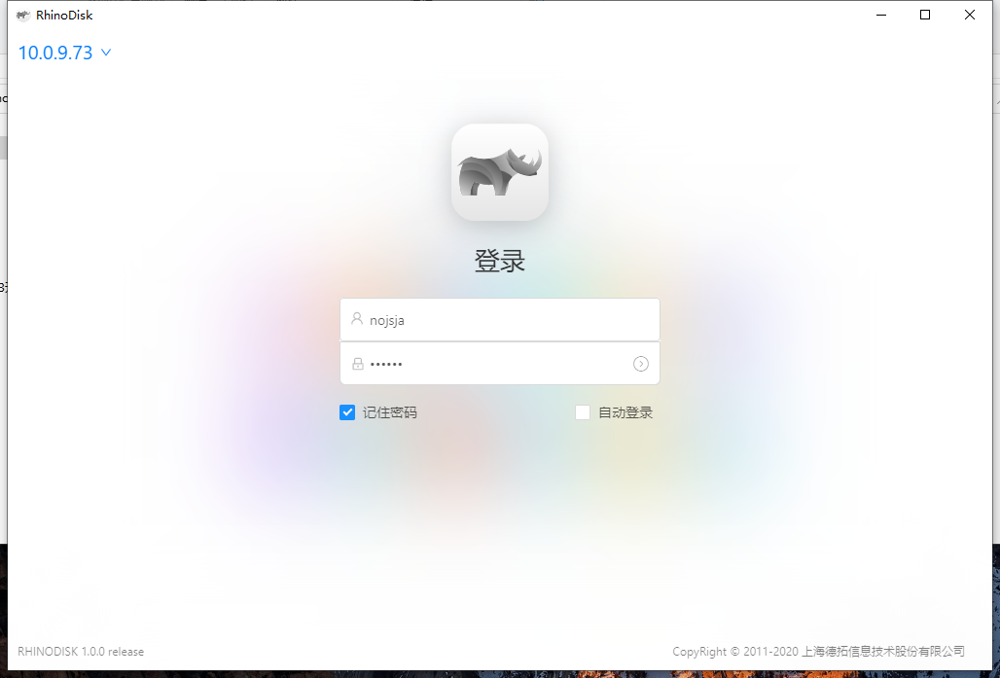
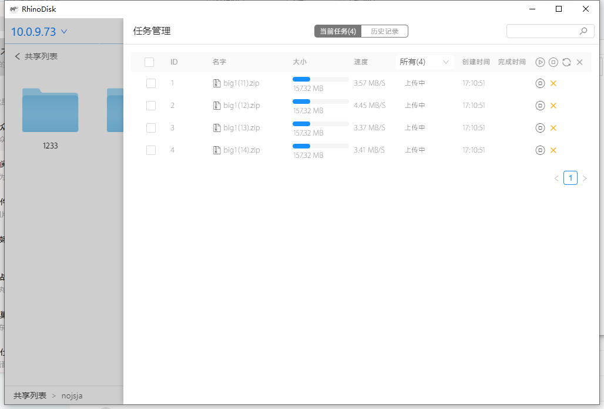
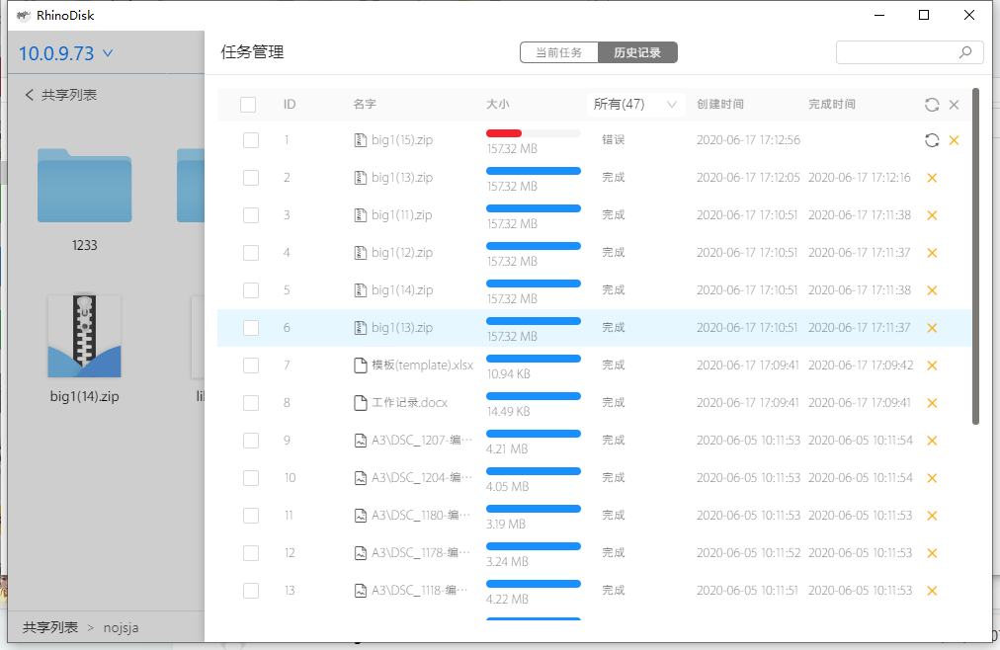

### 前言
---------------
最近拿到一个客户需求，需要利用现有部分后台接口和原生smb协议来实现一个windows平台的smb客户端，主要功能需要包含：存储集群节点管理、集群用户登录、远程共享目录挂载、共享目录浏览、目录权限设置、文件上传管理，其中目录权限设置和目录浏览接口已经被提供，其余几个功能的electron代码和web端代码需要由我负责。考虑整个项目由前端同事来实现且数据存储量较小、数据关系不复杂，所以技术选型方面使用了支持跨平台的Electron框架和易用的的本地json数据库[lowdb](https://github.com/typicode/lowdb)。

### 功能需求
---------------

#### 集群节点管理

1. 客户端需要支持多个节点(每个节点所属集群不同)的添加、删除操作
2. 支持设置默认节点操作用于自动登录功能
3. 添加节点的时候要进行ping逻辑判断目标节点是否可用
4. 调用存储集群ID获取接口保证每个集群只有一个节点被添加到集群管理列表

需求分析：节点IP列表、默认节点属性、节点用户登录信息均需要在本地json数据库存储管理，以便数据记录。


#### 集群用户登录

1. 支持已登录过客户端的用户自动下拉提示
2. 支持已记住密码的用户自动填充密码到输入框
3. 如果设置了默认节点，且默认节点的当前用户密码已经记住，则启动客户端时自动执行登录，类似QQ登录面板

需求分析：调用已有登录接口验证smb用户名和密码是否正确，然后拿到具有接口操作权限的access_token(注意直接走smb协议的操作无需使用token)，并且在本地json数据库存储用户名、密码、自动登录标识、用户节点登录记录等。



#### 远程共享目录挂载

1. windows资源管理器原生功能一样，将远程主机的smb共享挂载为本地的一个磁盘，方便用户使用windows资源管理器直接对文件和目录进行操作
2. 选择挂载设备时需要弹出所有空闲的磁盘盘符，支持范围C-Z

需求分析：同windows资源管理器原生功能一样，将远程主机的smb共享挂载为本地的一个磁盘，方便用户使用windows资源管理器直接对文件和目录进行操作，所有挂载信息包括空闲盘符、共享挂载状态 均需要使用windows cmd命令即时获取以防数据不一致的情况。


#### 文件上传管理

1. 文件上传管理能够查看当前任务列表的任务详情，包含上传速度、上传时间、完成时间、文件大小、文件名称，勾选进行中的任务后能够进行暂停、重传、删除、续传等操作。
2. 在任务列表的所有文件都被上传后会进行一次历史任务。
3. 任务历史记录中可以进行删除任务记录、恢复上传错误的历史任务(重传)等操作。
4. 切换不同节点重新登录用户上传任务不受影响，在当前节点重新登录用户上传任务会被强制终止，退出客户端后上传任务会被强制终止，各个用户的上传任务列表均不相同互不干扰，所有被强制终止的任务都能从历史任务列表中中恢复。

需求分析：当前任务列表即时存储于内存中，以便快速进行增删查改操作，任务历史记录使用json数据库进行本地存储；每次任务列表自动同步时将内存中的任务写入到本地json数据库里，并且任务列表数据从内存中释放。




### 实现难点
-----------

#### 公共部分

1. 多语言功能实现
2. 窗口大小动态记忆的实现
3. 托盘功能的实现
4. windows安装包打包配置

#### 远程共享目录挂载

1. 通用的命令执行函数(属于Sudo类的一个方法)
```js
  const child = require('child_process');
  const iconvLite = require('iconv-lite');
  /**
   * [exec 执行一个命令]
   * @param  { [String] }  command    [命令]
   * @param  { [Array | String] }   params  [参数数组]
   * @param  { [Object] }  options [exec可定制的参数]
   * @return { Promise }           [返回Promise对象]
   */
  async exec(_command, _params=[], _options={}) {
    const self = this;
    const params = Array.isArray(_params) ? _params.join(' ') : _params;
    const options = (typeof (_options) === 'object') ? _options : {};
    const command = `${_command} ${params}`;
    
    console.log(params, options, command);

    return new Promise(async (resolve, reject) => {
      child.exec(command, {...options, encoding: 'buffer'}, (_err, _stdout, _stderr) => {
        if (_err) {
          reject(_err);
        } else if (_stderr && _stderr.toString()) {
          reject(iconvLite.decode(_stderr,'cp936'));
        } else {
          resolve(iconvLite.decode(_stdout,'cp936'));
        }
      });
    });
  }

```

2. 获取空闲盘符和已经挂载盘符
```js
/**
    * getSystemDriveLetter [获取系统已经挂载的磁盘]
    * @return {[Array]} [盘符列表]
    */
  getSystemDriveLetter() {
    return new Promise((resolve) => {
      // cp.output.stdout.on('data', (d) => {
      //   console.log('out', d.toString());
      // })
      // cp.output.stderr.on('data', () => {
      //   console.log('err', d.toString());
      // });
      this.sudo.exec('fsutil fsinfo drives', [], { encoding: 'buffer' }).then((stdout) => {
        // const driverstr = (iconvLite.decode(stdout,'cp936')); 
        const driverstr = stdout;
        const driverstrArr = driverstr.split(' ').filter(s => s !== os.EOL).map(s => s.replace('\\', ''));
        const allDrivers = [
          'C:', 'D:', 'E:', 'F:', 'G:', 'H:', 'I:', 'J:', 'K:', 'L:',
          'M:', 'N:', 'O:', 'P:', 'Q:', 'R:', 'S:', 'T:', 'U:', 'V:',
          'W:', 'X:', 'Y:', 'Z:'
        ];
        driverstrArr.shift();
        resolve({
          code: 200,
          result: {
            mounted: driverstrArr,
            available: allDrivers.filter(d => !driverstrArr.includes(d.toLocaleUpperCase()))
          },
        })
      }, (err) => {
        console.error(err);
        resolve({
          code: 600,
          result: err,
        });
      });
    })
  }
```

2. 通过UNC命令对远程共享进行挂载
```js
/* 挂载共享 */
_mountSystemDriver_Windows_NT({ host, driver, path, auto = false }) {
    const pwd = global.ipcMainProcess.userModel.get('last.pwd');
    const { isThirdUser, nickname, isLocalUser, username } = global.ipcMainProcess.userModel.info;
    const commandUseIPC = `net use \\\\${host}\\ipc$ "${pwd}" /user:"${username}"`;
    const commandMount = `net use ${driver} \\\\${host}\\${path} "${pwd}" /user:"${username}"`;
    const commandUmount = `net use ${driver} /del /y`;

    return new Promise((resolve, reject) => {
      // 获取系统已经挂载的磁盘和空闲的磁盘
      this.getSystemDriveLetter()
        .then((rsp) => {
          if (rsp.code === 200) {
            if (rsp.result.mounted.includes(driver.toLocaleUpperCase())) {
              throw new Error(global.lang.node.driver_already_mount);
            }
          } else {
            throw new Error(global.lang.node.get_system_mount_info_failed);
          }
        })
        // 尝试UNC连接
        .then(() => {
          return this.sudo.exec(commandUseIPC);
        })
        // 执行挂载命令
        .then(() => {
          return this.sudo.exec(commandMount);
        })
        // 更新数据
        .then(() => {
          return this.update('mountPoint', { username, host, path }, {
            username, host, path, driver, auto
          });
        }).then((rsp) => {
          resolve({
            code: 200,
            result: {
              username, host, driver
            },
          });
        }).catch((err) => {
          console.error(err, err.toString());
          resolve({
            code: 600,
            result: global.lang.node.net_mount_failed_reason,
          });
        });
    });
  }
```

#### 文件上传管理


### 总结
--------
